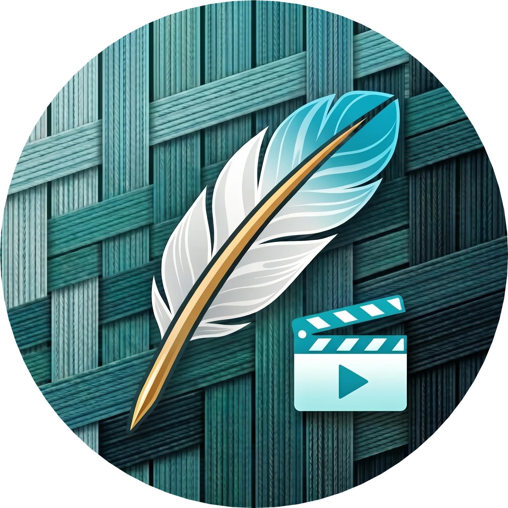
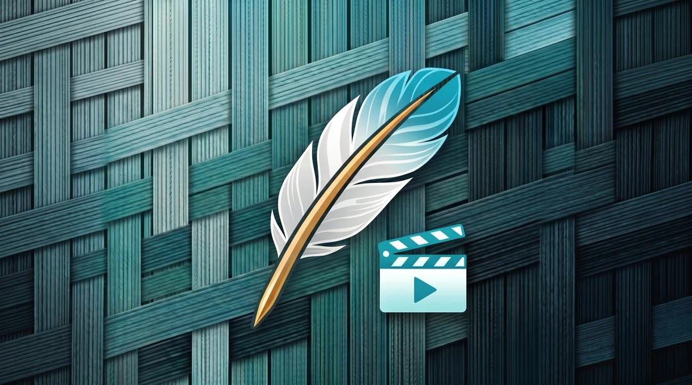
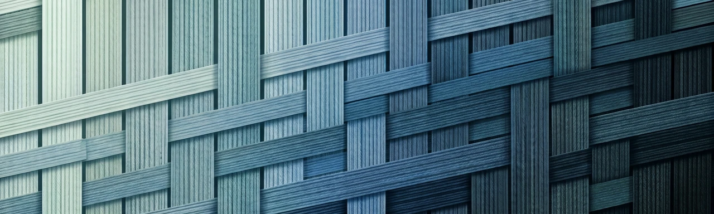

  

  
  
  
  

# CelSuite Video Helper Studio

**The Liquid Glass & Cyan Weave screen recorder — OBS-level power, zero bloat, kind to old hardware.**

## 🌟 Overview

**CelSuite Video Helper Studio** is a full screen-recording studio in one portable binary:

- **Dual-Engine Capture:** FFmpeg + OpenCV pipelines pick the fastest path for your machine — old hardware included.
- **Reactor UI:** Liquid Glass controls wrapped around a living Cyan Weave reactor that reacts while you record.
- **Pause / Resume:** Stop mid-recording, breathe, continue — stitch-free sessions.
- **AV Sync Studio:** Align audio and video tracks by eye and ear until they kiss.
- **Post Tools:** Trim, WAV export, GIF export, speed ramp, frame-snap — no second app needed.
- **Teleprompter + Gemini Director:** Scripted reads and AI-shot suggestions floating over your take.
- **Wallpaper Engine:** Bring your own wallpaper with tint control — ships bundled, fully portable.
- **9 Themes:** OLED, Liquid Glass and seven more moods.
- **Diagnostics Console:** Every pipeline hop inspectable when something looks off.

## 📦 Downloads & Releases

Both executables are built by GitHub Actions on every tag and published on the releases page.

👉 **[Download the Latest Release (v269.29.0)](https://github.com/HenryCarm/CelSuite_Video_Helper_Studio/releases/latest)**

| Platform | Download Asset | Type | Description |
| :-- | :-- | :-- | :-- |
| 🪟 **Windows** | `CelSuite_VHS-v269.29.0-Windows.exe` | Single File | Onefile Nuitka build — double-click and record |
| 🐧 **Linux** | `CelSuite_VHS-v269.29.0-Linux.bin` | Single File | Onefile Nuitka build — `chmod +x` and run |

## ✨ Key Features

- **Dual-Engine Capture:** FFmpeg for speed, OpenCV for precision — auto-switched per session.
- **Reactor UI:** Glass panels, live waveforms, a reactor core that pulses with your audio.
- **Pause / Resume:** Unlimited pauses, zero corrupt files.
- **AV Sync Studio:** Nudge, slip, and lock tracks with frame-accurate controls.
- **Trim / WAV / GIF / Speed / Frame-snap:** Cut the dead air, export the meme, ship the clip.
- **Teleprompter:** Scrollable prompt glass with adjustable pace, plus Gemini Director for shot ideas.
- **Wallpaper Engine with Tint:** Bundled Cyan Weave wallpaper, tint slider, or bring your own image.
- **9 Themes:** OLED, Liquid Glass, and seven more — session-rerollable.
- **Diagnostics Console:** Live pipeline log for FFmpeg, audio devices, and frame timing.

## 🛠️ Quick Setup

1. Download your platform's asset from the table above.
2. Run it — Windows: double-click the `.exe`; Linux: `chmod +x CelSuite_VHS-v269.29.0-Linux.bin` then launch.
3. Grant microphone and screen-recording permissions when asked.
4. Hit **REC**. That's it.

## 📜 Changelog

See [CHANGELOG.md](CHANGELOG.md) for the full version history and release notes.

## 📄 License

Proprietary — © 2026 HenryJayz. All rights reserved. Redistribution of unmodified binaries is welcome, claiming them as yours is not.

